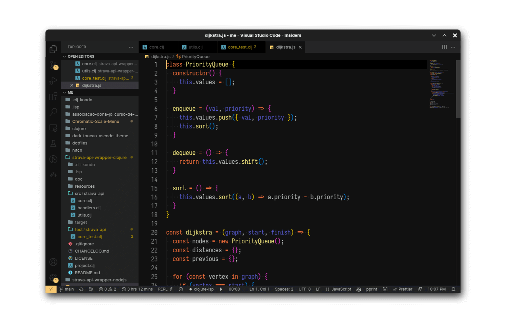

# Dark Toucan

Dark Toucan is a Visual Studio Code theme inspired by the vibrant colors of the toucan bird. The stunning mix of colors from a toucan's plumage creates a unique and visually appealing coding environment. This dark theme is designed to reduce eye strain while maintaining an enjoyable and engaging appearance.

  

## Installation

To install and activate the Dark Toucan theme, you can use one of the following method:

1. Click on the Extensions view icon located on the side bar or press Ctrl+Shift+X (Windows/Linux) or Cmd+Shift+X (Mac) to open the Extensions view.
2. Search for "Dark Toucan" in the search bar.
3. Click on the "Install" button next to the Dark Toucan theme in the search results.

## Manual installation

To install the Dark Toucan theme using the VSIX file, follow these steps:

1. Download the `.vsix` file from the repository or release page.
2. Open Visual Studio Code.
3. Go to the Extensions view by clicking on the square icon on the left sidebar or press `Ctrl+Shift+X`.
4. Click on the ellipsis (...) in the top right corner of the Extensions view.
5. Select "Install from VSIX..." from the dropdown menu.
6. Navigate to the folder where you downloaded the `.vsix` file, select it, and click "Open".
7. The theme will now be installed! To activate it, go to `File > Preferences > Color Theme` (or `Code > Preferences > Color Theme` on macOS) and choose "Dark Toucan" from the list.

## Buy me a beer 🍻

If you enjoy using the Dark Toucan theme and want to show your appreciation, consider **buying me a beer** through **PayPal** (marckfree@gmail.com). Your support helps me continue creating and improving this theme. Cheers!

## About the Author

I'm Marcos Lima, the creator of the Dark Toucan theme. If you have any questions, suggestions, or feedback, feel free to reach out to me at [marckfree@gmail.com](mailto:marckfree@gmail.com).
